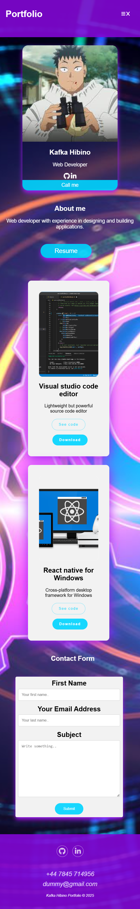

#Portfolio website challenge

I have applied the skills I’ve on week 1 Step8Up Bootcamp.

[Live website](https://gonzalopena1.github.io/Portfolio-web-page-challenge/)

##Technologies
Learned—HTML, CSS, display modes, forms, styling fonts, colors, selectors, and semantic HTML

##Project Demo

